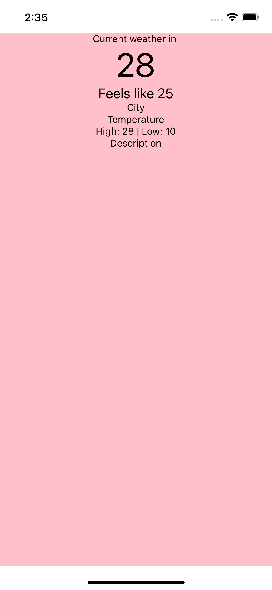

# ClimaApp
A Weather app on React Native using OpenWeather Free API

 
(in progress)

## Overview

I am following [this](https://www.youtube.com/watch?v=obH0Po_RdWk&list=PPSV) course to learn about React Native and track the progress and the final code. I am adding my own thing in some of the sections, based on my experience and preferences related to code organization, best practices that I read about and such. 

