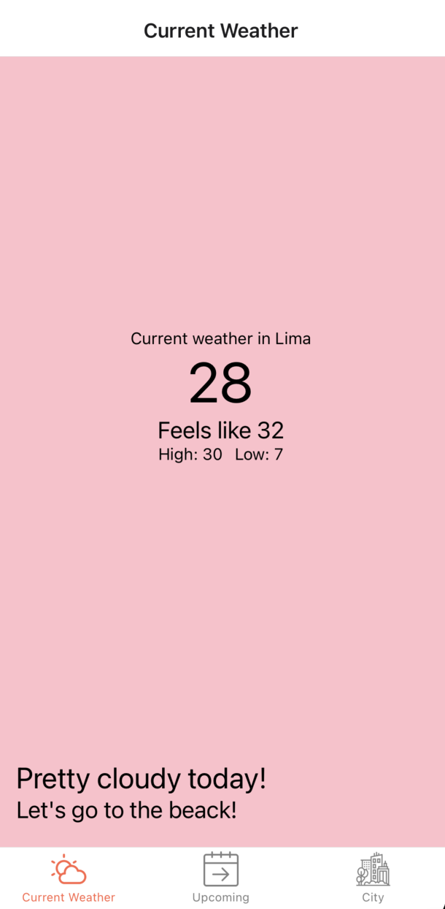

# ClimaApp [Work in Progress]

A Weather app on React Native using OpenWeather Free API

## Overview

I am currently following a [React Native course available on YouTube](https://www.youtube.com/watch?v=obH0Po_RdWk&list=PPSV). The course provides step-by-step guidance on React Native development, allowing me to track my progress and review the final code. Along the way, I'm also incorporating my own additions based on my experience, preferences, and knowledge of code organization and best practices that I've gathered from various sources.

**Currently doing: Loading state and API.**

## Credits

- <a href="https://www.flaticon.com/free-icons/sunset" title="sunset icons">Sunset and sunrise icons created by Mehwish - Flaticon</a>
- <a href="https://www.flaticon.com/free-icons/population" title="population icons">Population icons created by alfanz - Flaticon</a>
- <a href="https://www.flaticon.com/free-icons/weather" title="weather icons">Weather icons created by Freepik - Flaticon</a>
- <a href="https://www.flaticon.com/free-icons/upcoming" title="upcoming icons">Upcoming icons created by Ifanicon - Flaticon</a>
- <a href="https://www.flaticon.com/free-icons/urban" title="urban icons">Urban icons created by Eucalyp - Flaticon</a>
